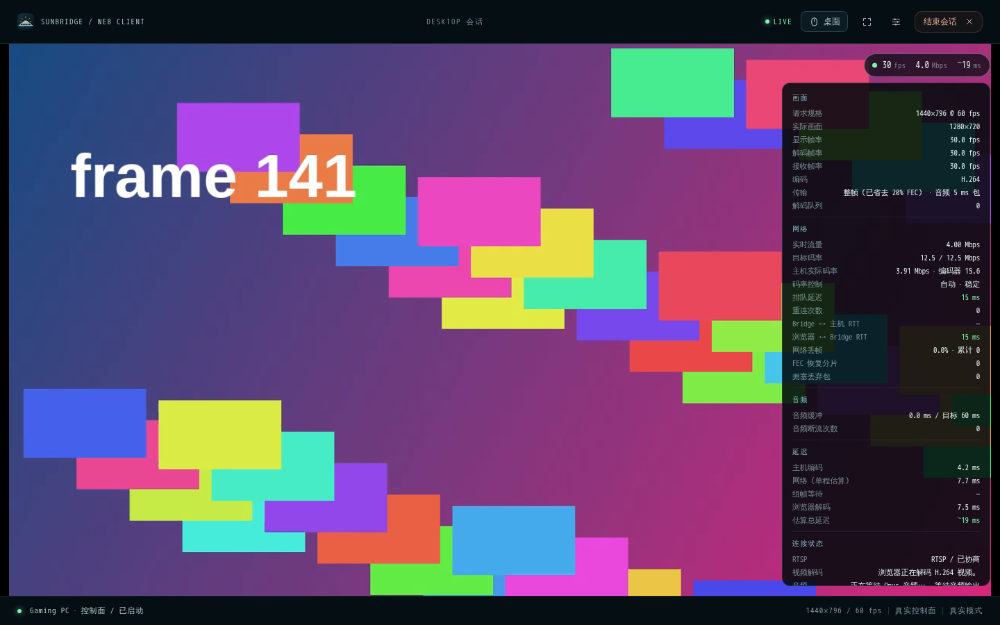
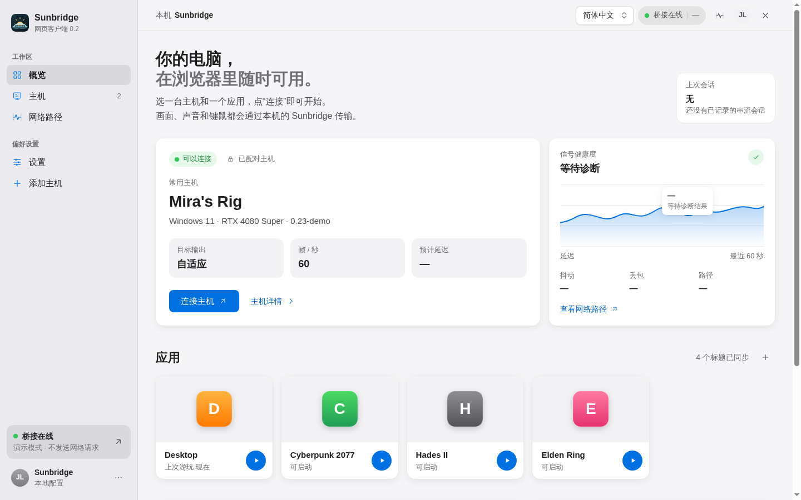
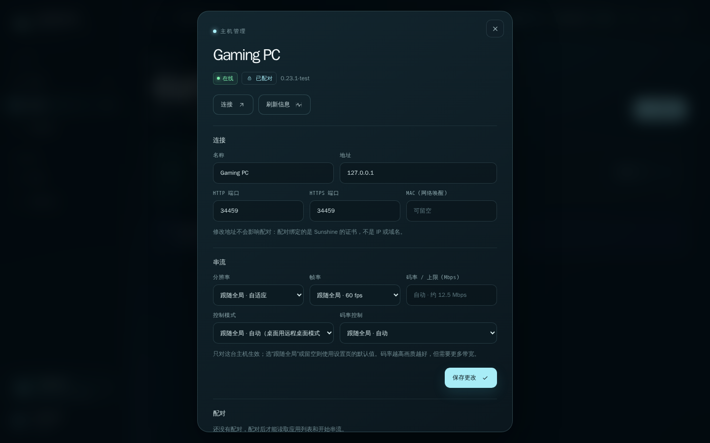

<p align="center">
  
</p>

<h1 align="center">Sunbridge</h1>

<p align="center">
  <b>打开浏览器，就能远程使用你的电脑。</b><br />
  把 <a href="https://github.com/LizardByte/Sunshine">Sunshine</a> 主机的画面、声音和控制带进网页：不用装客户端，手机、平板、公司电脑都能连。
</p>

<p align="center">
  <a href="LICENSE"></a>
  
  
  <a href="README.en.md">English</a>
</p>

<p align="center">
  
</p>

---

## 为什么做 Sunbridge

Sunshine 是很好用的串流主机，但想连上它，每台设备都得先装客户端。在公司电脑、借来的平板、不方便装软件的设备上，这一步往往就卡住了。

Sunbridge 跑在你自己的电脑上（通常就是装 Sunshine 的那台），把串流转成一个网页。只要有浏览器，登录后就能看到桌面、玩游戏、用键鼠和手柄。

- **零安装**：浏览器打开网址即可，手机、平板同样能用
- **为外网优化**：自动选 AV1 / HEVC，按网络状况调整码率，断线自动重连
- **远程桌面和游戏两用**：普通指针 + 触屏手势，或锁定鼠标 + 手柄
- **私有部署**：数据只在你自己的电脑上，带登录、HTTPS 和访问限制

## 特点

### 画面与带宽

- **自动选择最省带宽的编码**：浏览器能硬件解码 AV1 或 HEVC 时自动使用，同等画质下比 H.264 省 30–50% 码率。
- **只转发、不转码**：画面就是主机编码的原始码流，浏览器直接用 WebCodecs（优先硬件）解码，没有二次编码的画质损失和延迟。
- **去掉冗余**：Sunbridge 在本机把视频组装成完整帧再发给浏览器，不再传送纠错冗余和包头，外网带宽实测省约 25–30%，省下的预算交给编码器提升画质。
- **自适应分辨率**：按浏览器窗口的实际像素请求分辨率，文字清晰、不糊；改变窗口大小、旋转、全屏时自动跟随。

### 网络与稳定

- **自适应码率**：根据到浏览器的排队延迟和实际带宽实时调整，设定的码率是上限；实际码率超出上限会被自动压回去。
- **延迟有上限**：网络拥塞时按整帧丢弃并跳到下一个关键帧，画面只会短暂停顿，不会花屏，也不会越积越慢。
- **断线自动重连**：网络切换、电脑休眠唤醒、服务重启后自动恢复；刷新页面可以一键回到正在进行的串流。
- **清晰的状态反馈**：主机结束串流、应用退出、画面中断，页面都会明确告诉你发生了什么。

### 操作

- **远程桌面模式**：鼠标按绝对位置点击；触屏单指点按 / 拖动、长按或双指点按右键、双指滑动滚动；屏幕键盘支持中文。
- **游戏模式**：锁定鼠标、相对移动，支持手柄和震动。
- **全屏捕获系统按键**：全屏后 Win、Alt+Tab、Esc 等可以直接发给主机（浏览器允许时）。
- **声音**：Opus 立体声，播放端带抖动缓冲和时钟漂移校正，网络波动时不爆音。

### 管理与安全

- **一个脚本搞定**：`start.bat` / `start.sh` 菜单里设置密码、选择访问方式、启动、查看状态。
- **多种访问方式**：nginx / Caddy 反向代理（支持多个域名，自动生成配置）、直接用域名证书、自签名证书、仅本机。
- **主机管理**：修改地址、端口、网络唤醒；单独设置每台主机的分辨率、帧率、码率和控制模式。
- **安全**：所有页面和接口都需要登录；登录失败限速；跨站请求防护；配对私钥和账号数据永远不会通过网页暴露。

<p align="center">
  
  
</p>

## 工作原理

```
                 同一台电脑（或同一局域网）                    外网 / 局域网
┌───────────┐   UDP（RTP / FEC）   ┌─────────────┐   HTTPS + WebSocket   ┌──────────────┐
│ Sunshine  │ ───────────────────▶ │  Sunbridge  │ ────────────────────▶ │    浏览器    │
│ （编码）  │ ◀─────────────────── │ （转发服务）│ ◀──────────────────── │ （WebCodecs）│
└───────────┘   控制流（加密）     └─────────────┘   键鼠 / 手柄 / 触屏   └──────────────┘
```

Sunbridge 负责与 Sunshine 配对、协商串流、接收媒体，并把画面组装成完整帧通过一条 WebSocket 发给浏览器；浏览器负责解码、播放和采集输入。它与 Sunshine 之间使用标准的 GameStream 协议，不需要修改主机端。

## 快速开始

需要 [Node.js](https://nodejs.org/) 18 或更高版本（推荐 20+），以及一台运行 Sunshine 的主机。

```bash
git clone https://github.com/Ainierheokami/sunbridge.git
cd sunbridge
./start.sh        # Windows：双击 start.bat
```

在菜单里依次：

1. **设置或重置登录密码**：只能在这台电脑上设置，网页无法初始化。
2. **配置访问方式**：
   - **反向代理**（推荐）：已有 nginx / Caddy / cloudflared 提供 HTTPS 时使用，支持多个域名，会生成 nginx 配置到 `data/nginx.conf`。
   - **直接用域名证书**：把证书和私钥放进 `data/certs/`，自动识别；续期后替换文件即可，无需重启。
   - **自签名证书**：没有证书时使用，浏览器会提示不安全。
   - **仅本机**：只在这台电脑上打开 `http://127.0.0.1:8091/`。
3. **启动**，打开菜单显示的地址，登录后点“添加主机”，填 Sunshine 的地址并输入 Sunshine 网页上显示的 PIN 完成配对。

> 浏览器只在 HTTPS 或本机访问时开放视频解码、手柄和鼠标锁定，所以从其他设备访问时需要 HTTPS。

也可以直接带命令运行：`./start.sh start`、`./start.sh status`，`./start.sh help` 查看全部命令。

## 使用说明

| 操作 | 方式 |
| --- | --- |
| 切换远程桌面 / 游戏模式 | 串流顶栏的模式按钮 |
| 全屏（可捕获系统按键） | 串流顶栏的全屏按钮 |
| 释放鼠标 | Ctrl+Alt+Shift+Z |
| 结束串流 | Ctrl+Alt+Shift+Q 或顶栏“结束会话” |
| 串流统计（帧率、流量、延迟分解） | 右上角状态条，或 Ctrl+Alt+Shift+S |
| 屏幕键盘（触屏设备） | 远程桌面模式下顶栏的键盘按钮 |

设置页可以调整默认分辨率（默认“自适应”）、帧率、视频编码（默认“自动”）、码率控制和控制模式；每台主机还可以在主机列表右侧的 ⋯ 里单独设置。

## 目录

```
sunbridge/
├─ start.bat / start.sh   启动和管理
├─ app/                   程序文件（升级时整个替换）
├─ data/                  你的数据（首次运行后生成，已在 .gitignore 中排除）
└─ docs/                  文档图片
```

`data/` 里有配对私钥、账号和证书：**不要分享、不要提交到仓库**；升级时保留它，只替换 `app/`。

## 环境变量（可选）

一般用菜单配置即可，配置保存在 `data/config.json`；环境变量优先级更高。

| 变量 | 作用 |
| --- | --- |
| `SUNBRIDGE_PORT` | 端口，默认 8091 |
| `SUNBRIDGE_BIND` | 监听地址，如 `127.0.0.1`、`0.0.0.0` |
| `SUNBRIDGE_TLS` | `cert` / `self-signed` / `off` |
| `SUNBRIDGE_TLS_CERT` / `SUNBRIDGE_TLS_KEY` | 证书和私钥文件 |
| `SUNBRIDGE_TRUST_PROXY` | `1`：由反向代理提供 HTTPS |
| `SUNBRIDGE_TRUSTED_PROXIES` | 允许连接的反向代理地址，如 `127.0.0.1,172.16.0.0/12` |
| `SUNBRIDGE_ALLOWED_ORIGINS` | 额外允许的页面来源，如 `https://example.com` |
| `SUNBRIDGE_DATA_DIR` | 数据目录，默认 `data/` |

## 常见问题

**画面迟迟不出来？**
打开串流统计看“编码”和“视频解码”。设备不支持硬件解码 AV1 / HEVC 时会自动用 H.264；也可以在设置里手动指定 H.264。

**外网卡顿？**
码率控制保持“自动”，在主机管理里把码率上限设为略低于上行带宽。统计面板里的“排队延迟”持续很高说明带宽不够。

**地址栏显示证书有效，却有红色感叹号？**
通常是以前在这个域名上点过“继续前往（不安全）”。点地址栏左侧图标，选择“重新启用警告”，或重启浏览器。

**支持哪些浏览器？**
推荐最新版 Chrome / Edge（桌面和 Android）。其他支持 WebCodecs 的浏览器（较新的 Safari、Firefox）理论上可用，但还没有充分测试。HEVC 依赖系统的硬件解码支持。

## 许可证

[GNU General Public License v3.0](LICENSE)

本项目仅供学习交流使用，按“原样”提供，不附带任何担保。使用时请遵守当地法律法规，风险自负。
